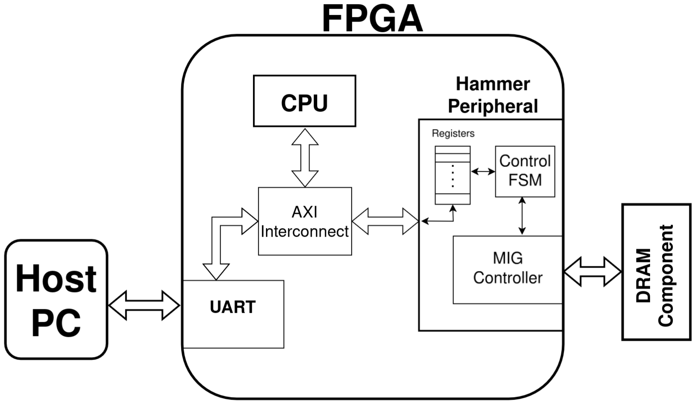

## Platform

Requirements: Vivado 2024.2 (with Vitis)

There are three subfolders here, each described in its own section.



Details about the architecture can be found in the paper.


### FPGA Board

This folder contain the code needed to setup the fpga platform, in particular:

- `bd` contains the definition of the block design that we designed
    and all the `.xci` files for the IP blocks that were used
- `sources` contains the `.vhd` files that describe the hammering 
    peripheral, together with the IP blocks that it uses
- `nexys-video` contains files specific to the Nexys Video board
    - `pinout.ucf` constraints to pass to the MIG wizard to assign
        the correct pins to the DRAM interface
    - `Nexys-Video-Master.xdc` constraint files used to assign
        the clock to the correct ports of the design

To implement in Vivado 2024.2 one needs to create a new project and add
the sources for the block design and the hammering peripheral.

The MIG controller needs to be configured such that the refresh is 
handled manyally. This cannot be done in the IP configurator wizard and
needs to be done by hand after the design has ben instantiated by
changing the parameter `USER_REFRESH` to `"ON"` and disabling the
out-of-context syntesys for this component.

Before running one needs to add the `.elf` file to the MicroBlaze
CPU that runs the test procedure. To obtain the `.elf` file.

NOTE: the design include two Integrated Logic Analyzer (ILA) blocks
for debug purposes and can be removed if not needed.

### CPU

This folder contains a single file `testperiph.c` that implements the 
logic needed to communicate via serial and handle tests on the hammering
peripheral. To use this file, follow the steps below.

After implementation, generate the bitstream and export the hardware
platform as an `.xsa` file, making sure to flag the "include bitstream"
field.

Launch Vitis and create a new project then:
- create a platform using the exported `.xsa`
- build the platform
- create an application, using the `peripheral_testing` template
- replace the `testperiph.c` with the one provided in this repo
- build the application

### Host PC

This folder contains the data collection campaign script that was used for 
the data collection phase of the paper.

- `paper-data-campaign.py` is the main script, inside one can find:
    - function to run a test with the given parameters (`do_test`)
    - function to write the results to a log file (`write_to_file`)
    - the script for the entire campaign
- `requirements.txt` lists the needed library, namely `pyserial` and `tqdm`

#### how to run

The `paper-data-campaign.py` script takes as argument the serial port to use
and the output folder to save the logs to.
For example, it can be run like this:
```
python3 ./paper-data-campaign.py /dev/ttyUSB0 data
```